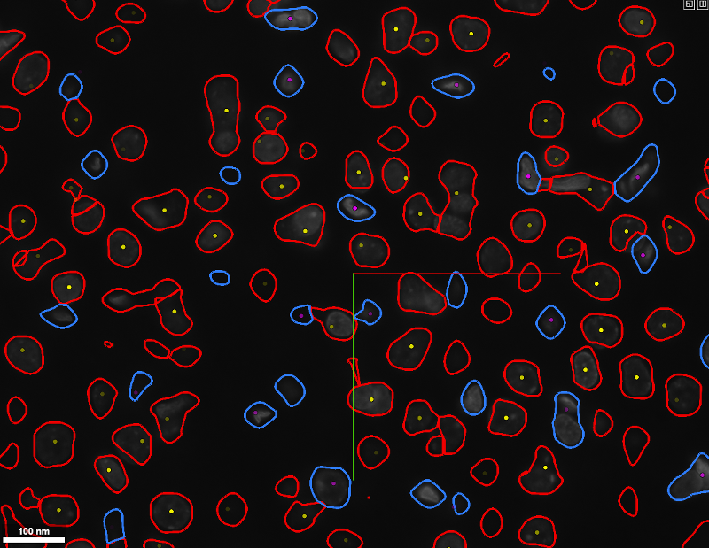
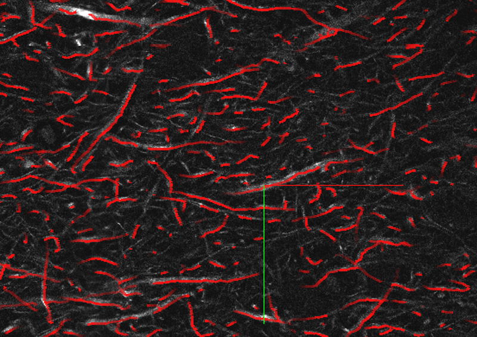

[](https://opensource.org/licenses/BSD-2-Clause)
# Overview
NeuroTrALE supports 3D imagery as well as corresponding annotations.  3D imagery is typically handled by serving up image tiles that comprise the current view.  This NeuroTrALE Precomputed Service implements the Precomputed format for imagery (tiles).  Annotations can be z-slice based (for smaller annotations like neuron/glia contours) or volume-based (for larger annotations like axons).  This Service also implements a proprietary interface to provide CRUD operations for such annotations.

Sample of a z-slice annotations file viewed via NeuroTrALE:



Sample of a fibers annotations file viewed via NeuroTrALE:



# API Documentation
Once the NeuroTrALE Precomputed Service is started, the swagger documentation is available (via a web browser) at ```/api/```.  It is also documented below:

## General
```
GET  /index.html
```
Retrieve the top-level directory containing datasets.  The response is an HTML page with URLs to individual datasets.
```
GET  /{some_path}
```
Catch-all for retrieving files that don't have ```.tiff``` or  ```.json``` file extensions.
## Precomputed Interface
```
GET  /{dataset_path}/{x}_{y}_{z}/{leaf_path}[.tiff]
```
Retrieve a TIFF file that is a tile of a 3d-image.  A large dataset may be comprised of smaller sub-volumes, and x,y,z determines which sub-volume is being referenced.
## Annotations Interface
```
GET  /{dataset_path}/annotations/{block}/{leaf_file}.json
```
Retrieve a json-formatted annotation file.
- Single z-slice of neuron/glia countours/centroids within the block (eg, z-1781.json)
- All of the axon centerline line segments in the block (eg, fibers.json)
- `block` specifies which sub-volume is referenced.  Format: xNNNyMMMzPPP , example: x1y2z1
```
PUT  /{dataset_path}/annotations/{block}/{leaf_file}.json
```
Replace entire contents of a json-formatted annotation file.
- `block` specifies which sub-volume is referenced.  Format: xNNNyMMMzPPP , example: x1y2z1
```
DELETE /{dataset_path}/annotations/{block}/{leaf_file}.json?id={id}
```
Delete an annotation within a json-formatted file given the annotation id.
- NOTE: Currently only works with fibers.json (Axon annotations)
- `block` specifies which sub-volume is referenced.  Format: xNNNyMMMzPPP , example: x1y2z1
```
PATCH /{dataset_path}/annotations/{block}/{leaf_file}.json?id={id}
```
Replace an existing annotation within a json-formatted file.
- If the annotation does not exist, create one with specified id.
- NOTE: Currently only works with fibers.json (Axon annotations)
- `block` specifies which sub-volume is referenced.  Format: xNNNyMMMzPPP , example: x1y2z1


# Filesystem
The files on the host are presented to the web client by setting the top-level dataset directory.
- If running the python code directly, use the PRECOMPUTED_PATH environment variable to set the top-level dataset directory.
- When using a docker container, defining a ```bind mount``` for the container's ```/data``` directory is used (ie, ```-v /host/data/dir:/data```)

From the top-level directory containing datasets (dataset directories), the directory tree looks like:
- ```my-dataset01-directory``` - The top-level directory for a dataset.
  - ```info``` - JSON-formatted file that describes the image tile directories
  - ```1_1_1``` - Image tile directory at the highest resolution
  - ```2_2_2``` - Image tile directory at half of the resolution (1/4 size)
  - ```...```
  - ```annotations``` - Directory containing annotation files/directories
     - ```block_info.csv``` - Describes the size of each block x,y,z in CSV format
     - ```x0y0z0``` - Directory containing annotations at block 0,0,0
        - ```fibers.json``` - File containing axon annotations for this block, in the form of line segments ("line-strings").
        - ```z-0001.json``` - Neuron/glia/centroid annotations for slice 0001 of this block.
        - ```z-0002.json``` - Neuron/glia/centroid annotations for slice 0002 of this block.
        - ```z-NNNN.json``` - Neuron/glia/centroid annotations for slice NNNN of this block.
     - ```x1y0z0``` - Directory containing annotations at block 1,0,0
     - ```...```
     - ```xNyMzP``` - Directory containing annotations at block N,M,P
- ```another-dataset-directory``` - Another top-level directory for another dataset.


# Building a Docker Image
The most common way to deploy the NeuroTrALE Precomputed Service is by using a docker image.  To build the docker image from this repo, us the "docker build" command as follows (don't foger the trailing dot!):

Without proxy settings:

```
docker build -t mitll/precomputed:1.0 .
```
To use proxy settings:
```
docker build -t mitll/precomputed:1.0 https_proxy="http://<proxy-uri>" --build-arg http_proxy="http://<proxy-uri>" .
```
# Running the Docker Image
after building the NeuroTrALE Precomputed Service, there are two ways to run it:
- Standalone mode
- Via docker-compose

## Running in Standalone Mode
You must provide the top-level host directory where the datasets live, and use it (in the command line) as a bind mount for /data.  Additionally, you must map port 9000 to access the container.  For example, to run in standalone mode using the host directory /data/precomputed as the bind mount:
```
docker run -d -p 9000:9000 -v /data/precomputed:/data mitll/precomputed:1.0
```
The default number of "workers" processing requests is 10, and can be changed by passing the --workers argument (for example, change to 15):
```
docker run -d -p 9000:9000 -v /data/precomputed:/data mitll/precomputed:1.0 --workers 15
```

## Running via Docker Compose
When the NeuroTrALE Precomputed Service is deployed along with NeuroTrALE, it is helpful to deploy all of the services together.  A reverse proxy (haproxy) is used to present both services as a single REST endpoint to client browsers.


## Using Apptainer (formerly Singularity)

Once the docker image is built (see section Building Docker Image), you can convert if to an Apptainer SIF image (Singularity Image File) to run it via 'apptainer'.  Note that docker and apptainer handle the filesystem differently.
```
apptainer  build  mitll-precomputed.sif  docker-daemon://mitll/precomputed:1.0
```
Now you can run using 'apptainer':
```
apptainer  run  --bind  /host/data/dir:/data  mitll-precomputed.sif  /apps/entrypoint.sh
```

## Related tools
The NeuroTrALE Precomputed Service simply serves up existing imagery and annotations, and allows updating annotations.  The imagery (image tiles) are ingested by using MIT's precomputed-tif tool, which takes a stack of tiff images and generates a directory tree of tiff files.  Refer to https://github.com/chunglabmit/precomputed-tif .
# Generating Image Tiles
Using MIT's precomputed-tiff tool, via command-line:
```
precomputed-tif --source <source-glob> \
                --dest <destination-folder> \
                --levels <levels>
```

# Annotations

Annotations (generated by a tool that tollows the file path and content patterns specified above) can be placed at the top level of the directory tree served by the NeuroTrALE Precomputed Service.

## Disclaimer
© 2024 Massachusetts Institute of Technology.

The software/firmware is provided to you on an As-Is basis
